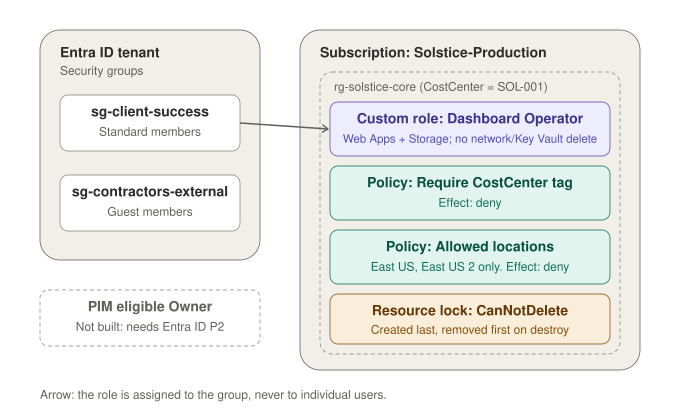

# Lab 01 — Identities & Governance
**Solstice Analytics — Azure Cloud Engineering Portfolio**
**AZ-104 Domain:** Manage Azure identities and governance (20–25%)

> **Note:** Solstice Analytics is a fictional company created for a personal portfolio lab series. The scenario is invented; the Azure work is real and was built and tested in my own subscription.

## Summary

- **Built** two Entra ID security groups, a custom least-privilege RBAC role ("Dashboard Operator") scoped to a single resource group, and a role assignment to a group instead of individuals.
- **Enforced** governance with two Azure Policies using the `deny` effect: a required `CostCenter` tag and an allowed-regions restriction (East US, East US 2), plus a `CanNotDelete` lock on the core resource group.
- **Verified** that untagged resources, out-of-region resources, and deletion of the resource group are all blocked (screenshots in Step 1).
- **Rebuilt as Infrastructure as Code:** designed in the portal first, then recreated in Terraform (9 resources, `azurerm` 5.8 / `azuread` 3.10), applied and destroyed cleanly.
- **Documented a real limitation:** PIM could not be implemented because it requires Entra ID P2 (see Known Limitations).

**Tools:** Microsoft Azure · Microsoft Entra ID · Azure RBAC · Azure Policy · Resource Locks · Terraform · PowerShell · Git/GitHub

**Jump to:** [Business Problem](#business-problem) · [Architectural Design](#architectural-design) · [Design Decisions](#design-decisions) · [Future Considerations](#future-considerations)

---

## Prerequisites

This is the first lab, so nothing has to exist before it. You need:

- An Azure subscription where your account holds **Owner** (creating role definitions, policy assignments and locks needs it).
- An Entra ID tenant where you can create security groups and invite B2B guests.
- Terraform 1.5 or later, Azure CLI signed in with `az login`, and PowerShell 7.
- The subscription ID, supplied to Terraform through a local `terraform.tfvars` file that stays out of version control.

## Business Problem

Solstice Analytics is a B2B SaaS company that builds retail sales-analytics dashboards for mid-size retail chains. The company is standing up a **Client Success team** and bringing on **two external contractors** to help with dashboard configuration for a new enterprise client. Engineering leadership has one hard requirement before anyone gets access to the subscription:

> "Nobody touches production by accident, nobody has more access than their job requires, and every resource that gets created has to be traceable to a cost center and an approved region."

Today the subscription has no formal access tiers, no tagging standard, and no policy preventing someone from spinning up resources in a non-approved region. This lab builds the governance layer that every later lab (storage, compute, networking, monitoring) will sit on top of.

## Architectural Design

Access is granted to **groups** in Entra ID, and the groups receive a custom role scoped to one resource group. Two `deny` policies and a delete lock on that resource group enforce the rules at deployment time, so the guardrails do not depend on anyone remembering them. Every later lab deploys under these controls.



| Layer | Resources (9 in Terraform) | Purpose |
|---|---|---|
| Identity | 2 Entra ID security groups: `sg-client-success`, `sg-contractors-external` | Access is managed by group membership, not by individual role assignments |
| Access control | Custom role `Dashboard Operator` and its role assignment to `sg-client-success` | Least privilege: read/write on Web Apps and Storage, no delete on networking or Key Vault |
| Governance | Custom policy definition `require-costcenter-tag` and 2 policy assignments (CostCenter tag, allowed locations) | Every resource is traceable to a cost center and kept in approved regions |
| Protection | `CanNotDelete` lock on `rg-solstice-core` | Nothing built on this foundation can be torn down by accident |
| Container | Resource group `rg-solstice-core` (`CostCenter = SOL-001`) | Scope for the role, policies and lock |

Resource layout:

```
Tenant: solsticeanalytics.onmicrosoft.com
│
├── Entra ID Groups
│   ├── sg-client-success        (standard members)
│   └── sg-contractors-external  (guest/limited members)
│
├── Subscription: Solstice-Production
│   └── Resource Group: rg-solstice-core
│       ├── Custom Role: "Dashboard Operator"
│       │     - read/write on Web Apps + Storage (data plane excluded)
│       │     - no delete on networking or Key Vault
│       ├── Azure Policy: "Require CostCenter tag"
│       ├── Azure Policy: "Allowed locations: East US, East US 2"
│       ├── Resource Lock: CanNotDelete on rg-solstice-core
│       └── PIM: eligible "Owner" assignment for break-glass admin
│             (not implemented — see Known Limitations)
```

## Design Decisions

- **Custom RBAC role over built-in roles.** Built-in Contributor is too broad (it can delete networking and Key Vault). A custom role scoped to exactly what Client Success needs keeps the blast radius small.
- **Groups, not individual role assignments.** Assigning roles to `sg-client-success` and `sg-contractors-external` instead of individual users means onboarding and offboarding is a group-membership change, not a role reassignment. It is the standard pattern for access management that scales.
- **Policy over documentation.** A tagging standard written in a wiki gets ignored. An Azure Policy with `deny` effect enforces it at deployment time.
- **PIM eligible, not permanent, for the break-glass admin.** Standing Owner access is a liability. Eligible assignment means the account has to actively activate the role (with justification/MFA) to use it, which is exactly what PIM is for. *(Not implemented in this environment — see Known Limitations below.)*
- **Resource lock at the resource-group level**, not per-resource, since this group holds shared governance resources that nothing later in the lab series should be able to tear down accidentally.
- **A reusable custom tag policy, assigned at resource-group scope.** The `require-costcenter-tag` definition is created once, and each resource group opts in by assigning it. Lab 02 reuses the same definition for its new resource groups instead of redefining it.
- **Azure's built-in "Allowed locations" definition, referenced by ID.** Microsoft maintains the definition, and only the parameter (`eastus`, `eastus2`) is specific to this lab.
- **The lock is ordered last with `depends_on`.** It is the final resource created and the first removed on destroy, so teardown is not blocked by the lock it manages.
- **Provider versions pinned to a major version, with the lock file committed.** `~> 5.0` and `~> 3.0` keep the code from moving to a new major version unannounced, and `.terraform.lock.hcl` records the exact builds (`azurerm` 5.8.0, `azuread` 3.10.0).

## Known Limitations

- **PIM was not implemented in this lab.** Privileged Identity Management requires Microsoft Entra ID P2 (or Entra ID Governance), which is not included in this tenant's Free tier. Self-service trial activation also wasn't possible because the tenant is tied to a personal Microsoft account rather than a verified business identity — Microsoft's trial/purchase flow requires business presence, which this tenant doesn't have.
- As a substitute, the administrative account holds a **standing (permanent) Owner role assignment** at the subscription level rather than a PIM eligible assignment.
- In a production tenant with Entra ID P2 licensing, this would instead be configured as a PIM eligible assignment, with the admin account operating under a lower-privilege role day-to-day and activating Owner only when needed, with justification and a time-bound window.

## Future Considerations

- Layer in **Conditional Access** (block contractor sign-in outside approved IP ranges) once the networking lab establishes a known egress IP.
- Move from a single "Dashboard Operator" role to a small role hierarchy (Operator / Reviewer / Admin) once the team grows past two tiers.
- Evaluate **Entra ID entitlement management** (access packages) instead of manual group membership once onboarding volume increases.

*Exam-prep notes mapping this lab to AZ-104 sub-skills are kept separately in [STUDY-NOTES.md](./STUDY-NOTES.md).*

---

## Step 1 — Build It in the Portal

1. **Create the groups.** Entra ID → Groups → New group → Security group. Create `sg-client-success` and `sg-contractors-external`. Leave membership type as Assigned for now.

   

2. **Add members.** Add internal members to `sg-client-success` and invite the two external contractors as B2B guests into `sg-contractors-external`; add them to the group once they accept.

   
   

3. **Create the resource group.** Resource Groups → Create → `rg-solstice-core`, region East US.

   

4. **Create the custom role.** Subscriptions → Access control (IAM) → Roles → Add → Add custom role.
   - Base it on Reader, then add `Microsoft.Web/sites/*` and `Microsoft.Storage/storageAccounts/*` actions, explicitly exclude `*/delete` on `Microsoft.Network/*` and `Microsoft.KeyVault/*`.
   - Assignable scope: `rg-solstice-core`.

   

5. **Assign the role.** IAM on `rg-solstice-core` → Add role assignment → your custom role → assign to `sg-client-success`.

   

6. **Create the policies.** Policy → Definitions → search "tag" and "location," or author custom ones:
   - "Require CostCenter tag" — effect `deny`; blocks any resource created without a `CostCenter` tag.
   - "Allowed locations" — built-in definition, restrict to East US / East US 2.
   - Assign both at the resource-group scope.

   
   

7. **Add the lock.** `rg-solstice-core` → Locks → Add → CanNotDelete.

8. **Set up PIM.** Not implemented in this environment — see Known Limitations. The administrative account instead holds a standing Owner assignment, shown below.

   

9. **Verify:** try creating a resource without a CostCenter tag (denied), try creating a resource outside East US / East US 2 (denied), try deleting the resource group (denied).

   
   
   

## Step 2 — Rebuild It in Terraform

With the design validated in the portal, the same environment was rebuilt as code. The portal-built resources were removed first so Terraform could create everything from scratch.

Provider versions (pinned in `.terraform.lock.hcl`): `azurerm` v5.8.0 and `azuread` v3.10.0. The `subscription_id` is supplied through a local `terraform.tfvars` file that is kept out of version control.

```
Terraform/
├── providers.tf
├── variables.tf
├── main.tf
├── outputs.tf
└── .terraform.lock.hcl
```

### Implementation Notes

- **References define the build order.** Blocks refer to each other (for example `azurerm_resource_group.core.id`), so Terraform builds the resource group before the role, policies and lock without being told.
- **Custom role.** `*/read` mirrors the "base it on Reader" step from the portal. `not_actions` subtracts the delete permissions on networking and Key Vault.
- **Role assignment.** `principal_type = "Group"` avoids "principal not found" errors when the group was created moments earlier.
- **Tag policy.** The custom definition uses mode `Indexed` and is assigned at the resource-group scope, so it denies any resource created inside `rg-solstice-core` without a `CostCenter` tag. The resource group itself carries `CostCenter = SOL-001`.
- **Allowed locations.** This uses Azure's built-in definition (referenced by ID) with a parameter limiting deployments to `eastus` and `eastus2`.
- **Lock ordering.** `depends_on` makes the lock the last resource created and therefore the first one removed on destroy, so teardown is not blocked by the lock.
- **Group membership.** Adding internal members and inviting the guest contractors was done in the portal (Step 1) and is not managed in Terraform.
- **PIM.** Not included in the Terraform code, for the same reason it was skipped in the portal: it requires Entra ID P2 (see Known Limitations).

### Terraform Code

The full code is in the [`Terraform`](./Terraform) folder. Expand each file below to view it.

<details>
<summary><code>providers.tf</code></summary>

```hcl
# Azure Provider source and versions
terraform {
  required_version = ">= 1.5"
  required_providers {
    azurerm = {
      source  = "hashicorp/azurerm"
      version = "~> 5.0"
    }
    azuread = {
      source  = "hashicorp/azuread"
      version = "~> 3.0"
    }
  }
}

provider "azurerm" {
  features {}
  subscription_id = var.subscription_id
}

provider "azuread" {}
```

</details>

<details>
<summary><code>variables.tf</code></summary>

```hcl
variable "subscription_id" {
  type        = string
  description = "Azure subscription ID"
}
```

</details>

<details>
<summary><code>main.tf</code></summary>

```hcl
resource "azuread_group" "client_success" {
  display_name     = "sg-client-success"
  security_enabled = true
}

resource "azuread_group" "contractors" {
  display_name     = "sg-contractors-external"
  security_enabled = true
}

resource "azurerm_resource_group" "core" {
  name     = "rg-solstice-core"
  location = "eastus"
  tags = {
    CostCenter = "SOL-001"
  }
}

resource "azurerm_role_definition" "dashboard_operator" {
  name        = "Dashboard Operator"
  scope       = azurerm_resource_group.core.id
  description = "Read/Write on Web Apps and Storage, no delete on networking or Key Vault"
  permissions {
    actions = [
      "*/read",
      "Microsoft.Web/sites/*",
      "Microsoft.Storage/storageAccounts/*",
    ]
    not_actions = [
      "Microsoft.Network/*/delete",
      "Microsoft.KeyVault/*/delete",
    ]
  }
  assignable_scopes = [azurerm_resource_group.core.id]
}

resource "azurerm_role_assignment" "client_success" {
  scope              = azurerm_resource_group.core.id
  role_definition_id = azurerm_role_definition.dashboard_operator.role_definition_resource_id
  principal_id       = azuread_group.client_success.object_id
  principal_type     = "Group"
}

resource "azurerm_policy_definition" "require_costcenter_tag" {
  name         = "require-costcenter-tag"
  policy_type  = "Custom"
  mode         = "Indexed"
  display_name = "Require CostCenter Tag"
  policy_rule = jsonencode({
    if = {
      field  = "tags['CostCenter']"
      exists = "false"
    }
    then = {
      effect = "deny"
    }
  })
}

resource "azurerm_resource_group_policy_assignment" "require_costcenter" {
  name                 = "require-costcenter"
  display_name         = "Require CostCenter Tag"
  resource_group_id    = azurerm_resource_group.core.id
  policy_definition_id = azurerm_policy_definition.require_costcenter_tag.id
}

resource "azurerm_resource_group_policy_assignment" "allowed_locations" {
  name                 = "allowed-locations"
  display_name         = "Allowed Locations: East US, East US 2"
  resource_group_id    = azurerm_resource_group.core.id
  policy_definition_id = "/providers/Microsoft.Authorization/policyDefinitions/e56962a6-4747-49cd-b67b-bf8b01975c4c"
  parameters = jsonencode({
    "listOfAllowedLocations" = {
      "value" = ["eastus", "eastus2"]
    }
  })
}

resource "azurerm_management_lock" "core" {
  name       = "core-cannotdelete"
  scope      = azurerm_resource_group.core.id
  lock_level = "CanNotDelete"
  depends_on = [
    azurerm_role_assignment.client_success,
    azurerm_resource_group_policy_assignment.require_costcenter,
    azurerm_resource_group_policy_assignment.allowed_locations,
  ]
}
```

</details>

<details>
<summary><code>outputs.tf</code></summary>

```hcl
output "resource_group_id" {
  value = azurerm_resource_group.core.id
}

output "client_success_group_object_id" {
  value = azuread_group.client_success.object_id
}
```

</details>

### Terraform Workflow

**Initialize.** Downloads the `azurerm` and `azuread` providers and creates the lock file.


**Plan.** Terraform refreshes the state of all nine resources and reports no infrastructure changes, only the new output values.


**State.** All nine resources are managed by Terraform: two groups, the resource group, the custom role and its assignment, the tag policy definition, both policy assignments, and the lock.


## Verify

Each guardrail was tested by trying to break it. Run the tests against `rg-solstice-core` with an account that can create resources there. A new policy assignment can take a few minutes to start denying requests.

| Test | How | Expected result |
|---|---|---|
| Missing tag | Create a resource in the group with no `CostCenter` tag | Denied with `RequestDisallowedByPolicy` (Require CostCenter Tag) |
| Wrong region | Create a tagged resource in a region other than East US or East US 2 | Denied with `RequestDisallowedByPolicy` (Allowed Locations) |
| Delete the group | Delete `rg-solstice-core` from the portal or CLI | Refused with `ScopeLocked` |
| Terraform matches reality | Run `terraform plan` after the apply | No infrastructure changes |

```powershell
# Denied: no CostCenter tag
az storage account create -g rg-solstice-core -n <unique-name> -l eastus --sku Standard_LRS

# Denied: region not allowed
az storage account create -g rg-solstice-core -n <unique-name> -l westus --sku Standard_LRS --tags CostCenter=SOL-001
```

The screenshots for each denial are in Step 1, step 9.

## Hands Off To Lab 02

Lab 02 builds directly on what exists now. It **looks up** these resources with Terraform `data` sources instead of redefining them:

- the `require-costcenter-tag` policy definition (found by name),
- the built-in "Allowed locations" definition (found by ID),
- the `sg-client-success` group (found by display name), which receives read-only access to the storage container that holds processed output.

Lab 02 also assigns both policies to its new resource groups, so the controls from this lab apply to everything built afterwards.

**Lab 01 must be applied before Lab 02.** If you destroyed it after finishing, run `terraform apply` in this lab's `Terraform` folder again. Group membership was added by hand in the portal, so re-add members to `sg-client-success` if you want to test Client Success access.

## Teardown

Destroy this lab **last**, after Labs 02 to 05 are gone. Later labs look up this lab's groups and policy definition, so destroying it first breaks their `terraform plan`.

```powershell
terraform destroy
```

Because the lock is managed in Terraform and ordered last by `depends_on`, `terraform destroy` removes it first and is not blocked. A lock created manually in the portal would have to be removed before the resource group could be deleted, which is a good thing to remember outside this lab.


## Cost

The resources in this lab (groups, role definition and assignment, policies, resource group and lock) have no direct cost. Everything was destroyed after the lab was completed.
