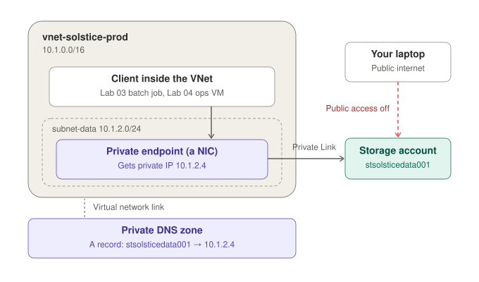
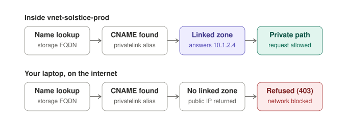

# Lab 02 — Study Notes
**AZ-104 Domain:** Implement and manage storage (15–20%)

These notes map Lab 02 to AZ-104 sub-skills. They are kept out of the lab README so the README stays focused on the project.

## What this lab exercises

| Exam sub-skill | Where it shows up in this lab |
|---|---|
| Storage redundancy | Choosing RA-GZRS and explaining LRS / ZRS / GRS / GZRS / RA- variants |
| Blob lifecycle management | Tiering and delete rules (Hot → Cool → Cold → delete) scoped by prefix; why Archive isn't offered on this account |
| Shared access signatures | Container-scoped SAS with defined permissions and expiry; why a SAS doesn't override network restrictions |
| Private endpoints and private DNS | Why the storage FQDN must resolve to a private IP inside the VNet |
| Storage RBAC | `Storage Blob Data Reader` at container scope vs. account keys |
| AzCopy | Bulk upload of test manifests |

## Key concept to know cold

**Archive is only supported on LRS, GRS and RA-GRS accounts.** It isn't supported on ZRS, GZRS or RA-GZRS, while Hot, Cool and Cold support every redundancy option. This lab hit that limit: on an RA-GZRS account the lifecycle rule builder offers only Cool, Cold and Delete.

Also know how Archive behaves: rehydrating a blob from Archive is not instant. It takes hours, you choose Standard or High priority, and you can't read or write an Archive blob until rehydration finishes. Lifecycle management only moves data *down* automatically. (Not exercised in this lab, but it is exam material.)

## Related facts worth remembering

- A SAS grants access to data; it does not change the network path. With public network access disabled, even a valid SAS is refused from the internet.
- Private endpoint DNS depends on the `privatelink.blob.core.windows.net` zone being **linked to the VNet** that needs to resolve it.
- Private endpoint subnets need the network policy setting enabled for NSGs or route tables to apply to them.
- Account keys give full access to the account; a user-delegation SAS is signed with Entra credentials and is the preferred option.

## How private endpoints, Private Link and private DNS fit together

- **Private endpoint:** a network interface that Azure places in your subnet. It takes a private IP from `subnet-data` (here `10.1.2.4`) and stands in for the storage account inside the VNet.
- **Private Link:** the service behind that interface. Traffic sent to `10.1.2.4` travels over the Microsoft backbone to the storage account. The private endpoint is the part of Private Link you deploy.
- **Private DNS zone (`privatelink.blob.core.windows.net`):** translates the storage account's normal name into the private IP, using an A record.
- **Virtual network link:** decides which VNets use the zone. Without a link, the zone exists but no VNet consults it.

Analogy: the private endpoint is an internal phone extension for the storage account, the private DNS zone is the company directory that lists it, and the virtual network link decides which offices get a copy of the directory. Everyone else is given the public number, and that line is disconnected once public access is off.

### Same name, different answer

Creating the private endpoint adds an alias to public DNS: `stsolsticedata001.blob.core.windows.net` now points to `stsolsticedata001.privatelink.blob.core.windows.net`. Both lookups follow that alias. Inside a linked VNet, Azure DNS finds the private zone and returns `10.1.2.4`. From the internet there is no linked zone, so the public IP comes back, and the request is refused because public access is disabled. Running `nslookup` from a laptop shows the `privatelink` alias in the chain, but a public address at the end.

## Troubleshooting facts from this lab

- **Read the error code, not just the 403.** `AuthorizationPermissionMismatch` means the credential is valid but lacks the permission (for a SAS, the wrong letters). `AuthorizationFailure` after lockdown means the request was blocked before permissions mattered, here by the network.
- **SAS permission letters.** `r` read, `a` add (append to append blobs), `c` create, `w` write, `d` delete, `l` list. Uploading a new block blob needs `c` or `w`; `a` alone isn't enough.
- **Management plane vs. data plane.** Disabling public network access blocks the blob endpoint (data plane) but not Azure Resource Manager (management plane). You can still change settings, re-enable access or delete the account from anywhere.
- **Deny policies and resources the portal can't tag.** A private DNS virtual network link supports tags, so an `Indexed` tag policy applies to it, but the private endpoint wizard and the link blade don't offer a tag field. Options: create it with the CLI or IaC (with tags), use a policy exemption, or use a `Modify` policy that adds the tag automatically.
