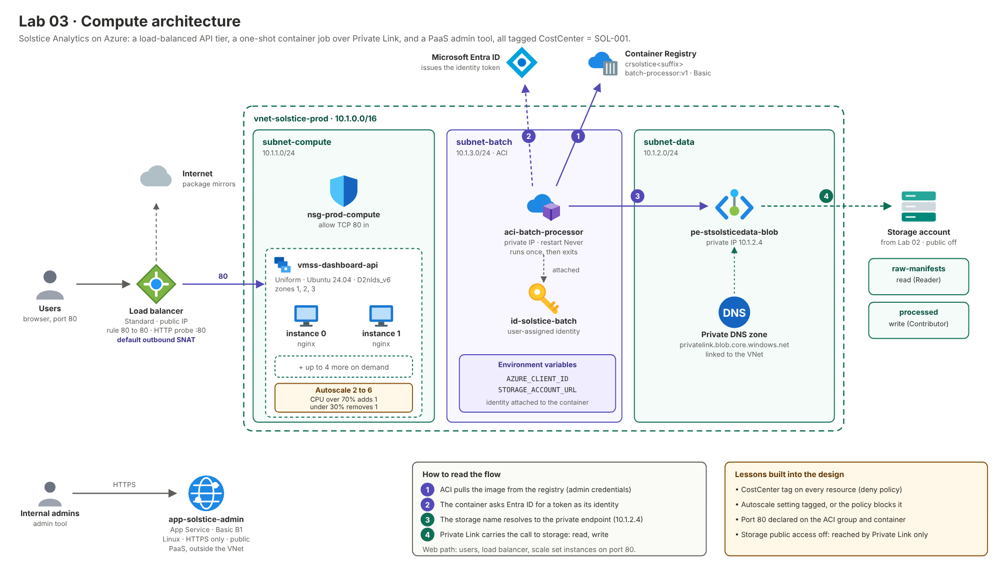

# Lab 03 — Compute
**Solstice Analytics — Azure Cloud Engineering Portfolio**
**AZ-104 Domain:** Deploy and manage Azure compute resources (20–25%)

> **Note:** Solstice Analytics is a fictional company created for a personal portfolio lab series. The scenario is invented; the Azure work is real and was built and tested in my own subscription.

## Summary

- **Built** a zone-redundant VM scale set behind a Standard load balancer, with CPU-based autoscale (2–6 instances, scale out above 70%, scale in below 30%).
- **Built** a containerised batch job (Azure Container Registry plus Container Instances) that reads the manifests from Lab 02 and writes a summary to `processed`, authenticating with a managed identity instead of keys.
- **Compared** IaaS and PaaS by running a small internal admin tool on App Service.
- **Extended Labs 01 and 02:** reused the governance policies, the prod VNet and the storage account.
- **Rebuilt as Infrastructure as Code**, including the two-step image and apply flow the batch job needs.

**Tools:** Microsoft Azure · Virtual Machine Scale Sets · Azure Load Balancer · Azure Monitor autoscale · Azure Container Registry · Azure Container Instances · App Service · Managed Identity · Terraform · Docker · Azure CLI

**Jump to:** [Business Problem](#business-problem) · [Architectural Design](#architectural-design) · [Design Decisions](#design-decisions) · [Known Limitations](#known-limitations) · [Future Considerations](#future-considerations)

---

## Builds On Labs 01 and 02

| From | How this lab uses it |
|---|---|
| Lab 01 policies | Assigned to `rg-solstice-compute`; all resources carry `CostCenter = SOL-001` |
| Lab 02 `vnet-solstice-prod` | Gets `subnet-compute` (10.1.1.0/24) for the scale set and `subnet-batch` (10.1.3.0/24) for the batch job |
| Lab 02 `rg-solstice-network` | Holds the new subnets and the compute NSG |
| Lab 02 storage account | The batch job reads and writes it as a managed identity with container-scoped RBAC |
| Lab 02 test manifests | The input the batch job processes |

**Before you start:** Labs 01 and 02 applied and the test manifests uploaded to `raw-manifests`. You also need an SSH key (`ssh-keygen -t rsa -b 4096` if `~/.ssh/id_rsa.pub` doesn't exist), Azure CLI, and the same `name_suffix` you used in Lab 02.

## Business Problem

Solstice's nightly batch job processes the manifest files from Lab 02 and refreshes client dashboards. The API layer that serves those dashboards sees a predictable traffic spike at month-end, when clients pull sales reports for board meetings. Leadership's ask after last month-end, when the API fell over:

> "The dashboard API needs to survive a zone going down, and it needs to scale itself before we get paged, not after."

Two further needs shaped the design. The nightly batch job should run without anyone managing a server for it, and without credentials stored in a container image. The small internal admin tool has none of the API's scale requirements, so it should cost as little operational effort as possible.

## Architectural Design

The design has three independent workloads sharing one network and one resource group. The dashboard API runs on a zone-redundant scale set behind a public load balancer. The nightly batch job runs as a short-lived container inside the prod VNet and reaches the Lab 02 storage account privately, as a managed identity. A small App Service hosts the internal admin tool as the PaaS comparison.



| Layer | Terraform resources | Purpose |
|---|---|---|
| Governance | 3: resource group, 2 policy assignments | `rg-solstice-compute` with the Lab 01 tag and location policies applied |
| Network | 5: 2 subnets, NSG, NSG rule, subnet association | `subnet-compute` and `subnet-batch` added to the Lab 02 VNet; NSG admits HTTP |
| Load balancing | 5: public IP, load balancer, backend pool, probe, rule | One public entry point for the API on port 80 |
| Compute | 2: scale set, autoscale setting | Zone-redundant API instances that scale 2 to 6 on CPU |
| Containers and identity | 5: registry, identity, 2 role assignments, container group | Batch job image, its identity, container-scoped storage roles, and the job itself |
| PaaS | 2: App Service plan, Linux web app | Internal admin tool |

The configuration also reads five existing objects with `data` sources: two policy definitions, the network resource group, the prod VNet and the storage account.

```
rg-solstice-network (Lab 02)
└── vnet-solstice-prod (10.1.0.0/16)
      ├── subnet-data     10.1.2.0/24   ← Lab 02 private endpoint
      ├── subnet-compute  10.1.1.0/24   ← NEW: scale set  (NSG: allow HTTP in)
      └── subnet-batch    10.1.3.0/24   ← NEW: batch job (delegated to ACI)

rg-solstice-compute (new)
├── Public IP + Standard Load Balancer  (port 80 → scale set)
├── VM Scale Set: vmss-dashboard-api    (Standard_D2nlds_v6, zones 1/2/3, 2–6 instances)
│     └── Autoscale: CPU > 70% → +1, CPU < 30% → −1
├── Container Registry: crsolstice<suffix>  (Basic)
├── User-assigned identity: id-solstice-batch
│     ├── Storage Blob Data Reader      → raw-manifests
│     └── Storage Blob Data Contributor → processed
├── Container Instance: aci-batch-processor  (in subnet-batch, runs once, exits)
└── App Service: app-solstice-admin-<suffix>  (B1, internal admin tool)
```

**How the pieces connect**

1. **API path.** A client reaches the load balancer's public IP on port 80. The load balancer's health probe picks healthy instances, and the NSG on `subnet-compute` admits only that traffic. Autoscale adds or removes instances based on average CPU.
2. **Batch path.** The Dockerfile and `batch.py` are built into an image by Azure Container Registry Tasks (`az acr build`), so no local Docker install is needed. The container group pulls the image, starts in `subnet-batch`, gets a token for `id-solstice-batch` from the Azure identity endpoint, reads CSVs from `raw-manifests`, writes a summary to `processed`, and exits.
3. **Admin tool.** App Service sits outside the VNet as a deliberate PaaS comparison against the scale set.

## Design Decisions

- **VMSS over a single VM for the API.** A single VM is a single point of failure. Zone-redundant instances survive an Availability Zone outage, and autoscale means nobody watches a dashboard at midnight on the last day of the month.
- **Autoscale has both directions.** A scale-out rule alone only ever grows the bill; the scale-in rule at 30% brings it back down. The gap between 30% and 70% stops the count from flapping, and the 5-minute cooldown gives new instances time to take load before the next decision.
- **A Standard load balancer needs an NSG.** Standard load balancers are closed by default, so `subnet-compute` carries an NSG that allows HTTP in. Rules are separate resources so Lab 04 can add more without the two configurations overwriting each other.
- **No public IPs on instances.** Only the load balancer's frontend is public. Instances have no direct internet inbound path; the subnet NSG only admits port 80.
- **Default outbound through the load balancer, replaced in Lab 04.** Instances have no public IPs, so their outbound traffic (boot-time package installs) leaves through the Standard load balancer's default outbound SNAT. That is enough for this lab and needs no extra resources. It is also unmanaged and shared with inbound traffic, so Lab 04 replaces it with a NAT gateway.
- **`Standard_D2nlds_v6` and Ubuntu 24.04.** The first plan used `Standard_B2s`, but no `B2s` capacity was available in this subscription, and `Standard_D2nlds_v6` was the size that was. The size is a variable-level detail, not an architectural one: any 2 vCPU size that supports zones works.
- **cloud-init bootstrap, not golden images**, at this stage. cloud-init installs `nginx` (so the load balancer probe has something to hit) and `stress-ng` (for the autoscale test) and writes a page that shows the hostname, which makes load balancing visible. Image Builder is a Future Consideration.
- **ACI inside the VNet, not on the public internet.** The batch job is deployed into a delegated subnet of the prod VNet, so it runs on the same private network as the Lab 02 storage account. That account has been locked down since Lab 02, so the VNet and its private endpoint are the only way the job can reach it. Because it has an IP address, ACI requires a port declared at both the group and container level even though the job never listens on one (see Findings).
- **Managed identity for storage, not keys.** The job authenticates as `id-solstice-batch`, scoped to read one container and write another. No secret is baked into the image, and the roles are separate: the job can't write to `raw-manifests` or read anything outside the two containers.
- **ACI for the batch processor, not another VM.** The job runs for seconds to minutes. A container group bills only while it runs, and there is no server to patch.
- **Image built in the registry (`az acr build`).** The build runs in Azure on a temporary agent and pushes straight to the registry, so the Docker daemon isn't needed locally and the image never leaves Azure's network.
- **A `deploy_batch_job` flag splits the apply in two.** The container group can't start until an image exists in the registry, and the registry is created by the same configuration. First apply with `false`, build the image, then apply with `true`.
- **App Service for the admin tool.** It has none of the API's scale requirements, so PaaS with nothing to patch is the right call. This is the deliberate comparison with the scale set: the IaaS design buys control and zone-level resilience at the cost of managing instances; the PaaS design trades that control for no OS management.

## Known Limitations

- **The batch script only processes loose `.csv` files.** The portal build uploaded the Lab 02 manifests as one `.zip`, and `batch.py` filters on `.csv`, so the Terraform run completed successfully but reported `0 manifests`. The identity, network path and write permission were still proven by the summary file it wrote. Reading zips is a small change using Python's `zipfile` module and was left out of scope.
- **ACR admin credentials are used for image pulls.** ACI can pull with a managed identity, but that requires a user-assigned identity with `AcrPull` and, in Microsoft's walkthrough, a Premium registry. This lab uses a Basic registry with the admin account instead. The admin password lands in Terraform state (which is gitignored); in production the answer is identity-based pull.
- **Image packages are unpinned.** `requirements.txt` lists `azure-identity` and `azure-storage-blob` without versions, so a rebuild can pick up newer releases than the build that was tested.
- **The batch job runs once per start, not nightly.** `restart_policy = "Never"` means it executes at creation and when started manually (`az container start`). Scheduling it is future work.
- **The load balancer is public and plain HTTP.** The API is exposed on port 80 through the load balancer so clients can reach it. There is no TLS, WAF or Application Gateway in front, and Lab 04 tightens the network around it without adding one.
- **Boot-time package installs depend on outbound internet and an external mirror.** Every instance replacement repeats the download, which is slow, and a mirror or SNAT problem fails cloud-init without failing the deployment.
- **Autoscale was configured but not load-tested in this run, to avoid the cost.** A real test scales the set out to extra instances for the length of the test. The rules are in place and the Verify section has the `stress-ng` procedure, but no scale-out event was captured, so this README does not claim one.
- **The storage account stays locked down, so nothing can be tested from outside the VNet.** Uploading new test manifests from a laptop is refused, as in Lab 02. Anything that reads or writes blobs has to run from inside the network, which is why the batch job is the test client here.
- **VM SKU and quota vary.** Size availability differs by region and subscription. `Standard_B2s` wasn't available here, and a different subscription may need a different size; check `az vm list-skus --location eastus --size <size> --zone`.
- **The admin app serves the default placeholder page.** No application code is deployed to it.

## Future Considerations

- Add zip support to `batch.py`, or have the ingestion step extract archives, so the Lab 02 portal-uploaded manifest zip is processed.
- Pin package versions in `requirements.txt` (and the base image digest) so rebuilds are reproducible.
- Replace ACR admin credentials with identity-based image pull (user-assigned identity with `AcrPull`).
- Container Apps jobs, or an Event Grid trigger from Lab 02's `raw-manifests` container, to start the batch run on a schedule or when a blob arrives.
- Azure Image Builder for a pre-baked scale set image once deploys are frequent enough that boot-time provisioning is a bottleneck.
- Azure Front Door or Application Gateway (with WAF and TLS) in front of the load balancer.
- A NAT gateway for outbound traffic from the scale set (planned for Lab 04).

*Exam-prep notes mapping this lab to AZ-104 sub-skills are kept separately in [STUDY-NOTES.md](./STUDY-NOTES.md).*

---

## Step 1 — Build It in the Portal

1. **Create `rg-solstice-compute`** in East US, tagged `CostCenter = SOL-001`, and assign the Lab 01 policies to it.

2. **Add subnets to `vnet-solstice-prod`:** `subnet-compute` (10.1.1.0/24) and `subnet-batch` (10.1.3.0/24, delegated to `Microsoft.ContainerInstance/containerGroups`).

3. **Create an NSG** `nsg-prod-compute` with an inbound rule allowing TCP 80 from `Internet`, and associate it with `subnet-compute`. (Standard load balancers are closed until an NSG allows the traffic.)

4. **Create the load balancer.** Standard SKU, public, zone-redundant IP, backend pool, HTTP probe on port 80, and a rule forwarding 80 → 80.

5. **Create the scale set.** `vmss-dashboard-api`: Ubuntu 24.04 LTS, `Standard_D2nlds_v6`, zones 1/2/3, 2 instances, no public IPs, in `subnet-compute`, attached to the load balancer's backend pool. Use cloud-init to install `nginx` and `stress-ng` and write a page that shows the hostname.

6. **Set autoscale.** VMSS → Scaling → Custom autoscale: min 2, max 6, default 2. Add a rule CPU > 70% over 5 minutes → +1 (cooldown 5 min) and a rule CPU < 30% → −1.

7. **Create the container registry** `crsolstice<suffix>` (Basic, admin user enabled).

8. **Create the identity** `id-solstice-batch` and give it `Storage Blob Data Reader` on `raw-manifests` and `Storage Blob Data Contributor` on `processed` (container-level IAM).

9. **Build and push the image** from the `app` folder (below).

10. **Create the container instance** `aci-batch-processor` in `subnet-batch` with a private IP, the identity attached, restart policy `Never`, and the environment variables `AZURE_CLIENT_ID` and `STORAGE_ACCOUNT_URL`.

11. **Create the App Service** (Linux, B1 plan) `app-solstice-admin-<suffix>`.

## Step 2 — Rebuild It in Terraform

```
Terraform/
├── providers.tf
├── variables.tf
├── data.tf
├── main.tf
├── outputs.tf
├── app/
│   ├── Dockerfile
│   ├── batch.py
│   └── requirements.txt
└── .terraform.lock.hcl
```

`terraform.tfvars` (not committed):

```hcl
subscription_id = "00000000-0000-0000-0000-000000000000"
name_suffix     = "rf01"   # same as Lab 02
```

### Implementation Notes

- **`data.tf` pulls in Labs 01 and 02** (policy definitions, the network resource group, the prod VNet and the storage account) by name. The suffix variable must match Lab 02.
- **Subnets are added to an existing VNet** through their own `azurerm_subnet` resources. Lab 02 owns the VNet; this lab only owns the subnets it adds, so destroying this lab removes only those.
- **NSG rules are separate resources**, not inline, so Lab 04 can add rules to the same NSG without the two configurations overwriting each other.
- **Outbound traffic** for the instances (cloud-init package installs) uses the Standard load balancer's default outbound SNAT. Lab 04 replaces this with a NAT gateway.
- **Container-scoped role assignments** are built from the storage account ID plus the container path, so the identity gets access to exactly two containers.
- **`deploy_batch_job` splits the apply in two.** The container group can't start until an image exists in the registry, and the registry is created by this same configuration. First apply with `false`, push the image, apply again with `true`.
- **The batch container group `depends_on` the role assignments** so it doesn't start before its permissions exist. Role assignments can still take a few minutes to propagate, so a first-run `403` is not unusual.
- **The container group declares port 80 twice** (`exposed_port` on the group and `ports` on the container). ACI rejects an IP-addressed group with no ports, and the provider requires the two blocks to match.

### Terraform Code

<details>
<summary><code>providers.tf</code></summary>

```hcl
# Azure Provider source and versions
terraform {
  required_version = ">= 1.5"
  required_providers {
    azurerm = {
      source  = "hashicorp/azurerm"
      version = "~> 5.0"
    }
  }
}

provider "azurerm" {
  features {}
  subscription_id = var.subscription_id
}
```

</details>

<details>
<summary><code>variables.tf</code></summary>

```hcl
variable "subscription_id" {
  type        = string
  description = "Azure subscription ID"
}

variable "name_suffix" {
  type        = string
  description = "Same suffix used in Lab 02"
}

variable "ssh_public_key_path" {
  type        = string
  description = "Path to the SSH public key installed on the scale set instances"
  default     = "~/.ssh/id_rsa.pub"
}

variable "deploy_batch_job" {
  type        = bool
  description = "false on the first apply (the image does not exist yet), true after the image is pushed to ACR"
  default     = false
}
```

</details>

<details>
<summary><code>data.tf</code></summary>

```hcl
# Lab 01
data "azurerm_policy_definition" "require_costcenter" {
  name = "require-costcenter-tag"
}

data "azurerm_policy_definition" "allowed_locations" {
  name = "e56962a6-4747-49cd-b67b-bf8b01975c4c"
}

# Lab 02
data "azurerm_resource_group" "network" {
  name = "rg-solstice-network"
}

data "azurerm_virtual_network" "prod" {
  name                = "vnet-solstice-prod"
  resource_group_name = data.azurerm_resource_group.network.name
}

data "azurerm_storage_account" "solstice" {
  name                = "stsolsticedata${var.name_suffix}"
  resource_group_name = "rg-solstice-data"
}
```

</details>

<details>
<summary><code>main.tf</code></summary>

```hcl
locals {
  location = "eastus"
  tags = {
    CostCenter = "SOL-001"
  }

  # Container-scope IDs for the Lab 02 containers
  raw_container_id       = "${data.azurerm_storage_account.solstice.id}/blobServices/default/containers/raw-manifests"
  processed_container_id = "${data.azurerm_storage_account.solstice.id}/blobServices/default/containers/processed"
}

# ---------- Resource group + Lab 01 governance ----------
resource "azurerm_resource_group" "compute" {
  name     = "rg-solstice-compute"
  location = local.location
  tags     = local.tags
}

resource "azurerm_resource_group_policy_assignment" "require_costcenter" {
  name                 = "require-costcenter"
  display_name         = "Require CostCenter Tag"
  resource_group_id    = azurerm_resource_group.compute.id
  policy_definition_id = data.azurerm_policy_definition.require_costcenter.id
}

resource "azurerm_resource_group_policy_assignment" "allowed_locations" {
  name                 = "allowed-locations"
  display_name         = "Allowed Locations: East US, East US 2"
  resource_group_id    = azurerm_resource_group.compute.id
  policy_definition_id = data.azurerm_policy_definition.allowed_locations.id
  parameters = jsonencode({
    "listOfAllowedLocations" = {
      "value" = ["eastus", "eastus2"]
    }
  })
}

# ---------- Subnets added to the Lab 02 prod VNet ----------
resource "azurerm_subnet" "compute" {
  name                 = "subnet-compute"
  resource_group_name  = data.azurerm_resource_group.network.name
  virtual_network_name = data.azurerm_virtual_network.prod.name
  address_prefixes     = ["10.1.1.0/24"]
}

resource "azurerm_subnet" "batch" {
  name                 = "subnet-batch"
  resource_group_name  = data.azurerm_resource_group.network.name
  virtual_network_name = data.azurerm_virtual_network.prod.name
  address_prefixes     = ["10.1.3.0/24"]

  delegation {
    name = "aci"
    service_delegation {
      name    = "Microsoft.ContainerInstance/containerGroups"
      actions = ["Microsoft.Network/virtualNetworks/subnets/action"]
    }
  }
}

# Standard load balancers are closed by default, so the subnet needs an NSG.
# Rules are separate resources so Lab 04 can add more without fighting this block.
resource "azurerm_network_security_group" "prod_compute" {
  name                = "nsg-prod-compute"
  resource_group_name = data.azurerm_resource_group.network.name
  location            = local.location
  tags                = local.tags
}

resource "azurerm_network_security_rule" "allow_http" {
  name                        = "allow-http-inbound"
  priority                    = 100
  direction                   = "Inbound"
  access                      = "Allow"
  protocol                    = "Tcp"
  source_port_range           = "*"
  destination_port_range      = "80"
  source_address_prefix       = "Internet"
  destination_address_prefix  = "*"
  resource_group_name         = data.azurerm_resource_group.network.name
  network_security_group_name = azurerm_network_security_group.prod_compute.name
}

resource "azurerm_subnet_network_security_group_association" "prod_compute" {
  subnet_id                 = azurerm_subnet.compute.id
  network_security_group_id = azurerm_network_security_group.prod_compute.id
}

# ---------- Load balancer in front of the API ----------
resource "azurerm_public_ip" "api" {
  name                = "pip-dashboard-api"
  resource_group_name = azurerm_resource_group.compute.name
  location            = local.location
  allocation_method   = "Static"
  sku                 = "Standard"
  zones               = ["1", "2", "3"]
  tags                = local.tags
}

resource "azurerm_lb" "api" {
  name                = "lb-dashboard-api"
  resource_group_name = azurerm_resource_group.compute.name
  location            = local.location
  sku                 = "Standard"
  tags                = local.tags

  frontend_ip_configuration {
    name                 = "frontend"
    public_ip_address_id = azurerm_public_ip.api.id
  }
}

resource "azurerm_lb_backend_address_pool" "api" {
  name            = "backend-pool"
  loadbalancer_id = azurerm_lb.api.id
}

resource "azurerm_lb_probe" "http" {
  name            = "probe-http"
  loadbalancer_id = azurerm_lb.api.id
  protocol        = "Http"
  port            = 80
  request_path    = "/"
}

resource "azurerm_lb_rule" "http" {
  name                           = "rule-http"
  loadbalancer_id                = azurerm_lb.api.id
  protocol                       = "Tcp"
  frontend_port                  = 80
  backend_port                   = 80
  frontend_ip_configuration_name = "frontend"
  backend_address_pool_ids       = [azurerm_lb_backend_address_pool.api.id]
  probe_id                       = azurerm_lb_probe.http.id
}

# ---------- Scale set ----------
resource "azurerm_linux_virtual_machine_scale_set" "dashboard_api" {
  name                = "vmss-dashboard-api"
  resource_group_name = azurerm_resource_group.compute.name
  location            = local.location
  sku                 = "Standard_D2nlds_v6"
  instances           = 2
  zones               = ["1", "2", "3"]
  admin_username      = "solsticeadmin"
  tags                = local.tags

  admin_ssh_key {
    username   = "solsticeadmin"
    public_key = file(pathexpand(var.ssh_public_key_path))
  }

  source_image_reference {
    publisher = "Canonical"
    offer     = "ubuntu-24.04-lts"
    sku       = "server"
    version   = "latest"
  }

  os_disk {
    storage_account_type = "Standard_LRS"
    caching              = "ReadWrite"
  }

  # Bootstrap: web server for the LB probe, plus stress-ng for the autoscale test
  custom_data = base64encode(<<-CLOUDINIT
    #cloud-config
    package_update: true
    packages:
      - nginx
      - stress-ng
    runcmd:
      - echo "Solstice dashboard API - served by $(hostname)" > /var/www/html/index.html
  CLOUDINIT
  )

  network_interface {
    name    = "nic-dashboard-api"
    primary = true

    ip_configuration {
      name                                   = "internal"
      primary                                = true
      subnet_id                              = azurerm_subnet.compute.id
      load_balancer_backend_address_pool_ids = [azurerm_lb_backend_address_pool.api.id]
    }
  }

  depends_on = [azurerm_subnet_network_security_group_association.prod_compute]
}

resource "azurerm_monitor_autoscale_setting" "dashboard_api" {
  name                = "autoscale-dashboard-api"
  resource_group_name = azurerm_resource_group.compute.name
  location            = local.location
  target_resource_id  = azurerm_linux_virtual_machine_scale_set.dashboard_api.id
  tags                = local.tags

  profile {
    name = "default"

    capacity {
      default = 2
      minimum = 2
      maximum = 6
    }

    rule {
      metric_trigger {
        metric_name        = "Percentage CPU"
        metric_resource_id = azurerm_linux_virtual_machine_scale_set.dashboard_api.id
        time_grain         = "PT1M"
        statistic          = "Average"
        time_window        = "PT5M"
        time_aggregation   = "Average"
        operator           = "GreaterThan"
        threshold          = 70
      }
      scale_action {
        direction = "Increase"
        type      = "ChangeCount"
        value     = "1"
        cooldown  = "PT5M"
      }
    }

    rule {
      metric_trigger {
        metric_name        = "Percentage CPU"
        metric_resource_id = azurerm_linux_virtual_machine_scale_set.dashboard_api.id
        time_grain         = "PT1M"
        statistic          = "Average"
        time_window        = "PT5M"
        time_aggregation   = "Average"
        operator           = "LessThan"
        threshold          = 30
      }
      scale_action {
        direction = "Decrease"
        type      = "ChangeCount"
        value     = "1"
        cooldown  = "PT5M"
      }
    }
  }
}

# ---------- Container registry + batch job ----------
resource "azurerm_container_registry" "solstice" {
  name                = "crsolstice${var.name_suffix}"
  resource_group_name = azurerm_resource_group.compute.name
  location            = local.location
  sku                 = "Basic"
  admin_enabled       = true # documented compromise, see Known Limitations
  tags                = local.tags
}

# The job reaches storage as this identity, not with account keys
resource "azurerm_user_assigned_identity" "batch" {
  name                = "id-solstice-batch"
  resource_group_name = azurerm_resource_group.compute.name
  location            = local.location
  tags                = local.tags
}

resource "azurerm_role_assignment" "batch_read_raw" {
  scope                = local.raw_container_id
  role_definition_name = "Storage Blob Data Reader"
  principal_id         = azurerm_user_assigned_identity.batch.principal_id
  principal_type       = "ServicePrincipal"
}

resource "azurerm_role_assignment" "batch_write_processed" {
  scope                = local.processed_container_id
  role_definition_name = "Storage Blob Data Contributor"
  principal_id         = azurerm_user_assigned_identity.batch.principal_id
  principal_type       = "ServicePrincipal"
}

resource "azurerm_container_group" "batch_processor" {
  count               = var.deploy_batch_job ? 1 : 0
  name                = "aci-batch-processor"
  resource_group_name = azurerm_resource_group.compute.name
  location            = local.location
  os_type             = "Linux"
  restart_policy      = "Never"
  ip_address_type     = "Private"
  subnet_ids          = [azurerm_subnet.batch.id]
  tags                = local.tags

  # Must match a ports block on the container below
  exposed_port {
    port     = 80
    protocol = "TCP"
  }

  identity {
    type         = "UserAssigned"
    identity_ids = [azurerm_user_assigned_identity.batch.id]
  }

  image_registry_credential {
    server   = azurerm_container_registry.solstice.login_server
    username = azurerm_container_registry.solstice.admin_username
    password = azurerm_container_registry.solstice.admin_password
  }

  container {
    name   = "batch-processor"
    image  = "${azurerm_container_registry.solstice.login_server}/batch-processor:v1"
    cpu    = 0.5
    memory = 1

    # ACI requires a port on any group with an IP address, even though the job never listens
    ports {
      port     = 80
      protocol = "TCP"
    }

    environment_variables = {
      AZURE_CLIENT_ID     = azurerm_user_assigned_identity.batch.client_id
      STORAGE_ACCOUNT_URL = "https://${data.azurerm_storage_account.solstice.name}.blob.core.windows.net"
    }
  }

  depends_on = [
    azurerm_role_assignment.batch_read_raw,
    azurerm_role_assignment.batch_write_processed,
  ]
}

# ---------- App Service (the deliberate PaaS comparison) ----------
resource "azurerm_service_plan" "admin" {
  name                = "asp-solstice-admin"
  resource_group_name = azurerm_resource_group.compute.name
  location            = local.location
  os_type             = "Linux"
  sku_name            = "B1"
  tags                = local.tags
}

resource "azurerm_linux_web_app" "admin" {
  name                = "app-solstice-admin-${var.name_suffix}"
  resource_group_name = azurerm_resource_group.compute.name
  location            = local.location
  service_plan_id     = azurerm_service_plan.admin.id
  https_only          = true
  tags                = local.tags

  site_config {}
}
```

</details>

<details>
<summary><code>outputs.tf</code></summary>

```hcl
output "api_public_ip" {
  value = azurerm_public_ip.api.ip_address
}

output "acr_name" {
  value = azurerm_container_registry.solstice.name
}

output "vmss_name" {
  value = azurerm_linux_virtual_machine_scale_set.dashboard_api.name
}

output "admin_app_hostname" {
  value = azurerm_linux_web_app.admin.default_hostname
}
```

</details>

<details>
<summary><code>app/Dockerfile</code></summary>

```dockerfile
FROM python:3.12-slim
WORKDIR /app
COPY requirements.txt .
RUN pip install --no-cache-dir -r requirements.txt
COPY batch.py .
CMD ["python", "batch.py"]
```

</details>

<details>
<summary><code>app/requirements.txt</code></summary>

```text
azure-identity
azure-storage-blob
```

</details>

<details>
<summary><code>app/batch.py</code></summary>

```python
"""Solstice nightly manifest processor.

Reads every CSV in the raw-manifests container, counts the rows, and writes a
summary file to the processed container. Authenticates with the user-assigned
managed identity, so there are no keys or SAS tokens in the image.
"""
import csv
import io
import os
from datetime import datetime, timezone

from azure.identity import ManagedIdentityCredential
from azure.storage.blob import BlobServiceClient

account_url = os.environ["STORAGE_ACCOUNT_URL"]
credential = ManagedIdentityCredential(client_id=os.environ["AZURE_CLIENT_ID"])
service = BlobServiceClient(account_url, credential=credential)

raw = service.get_container_client("raw-manifests")
processed = service.get_container_client("processed")

print(f"Processing manifests from {account_url} ...", flush=True)

rows = [("manifest", "data_rows")]
for blob in raw.list_blobs():
    if not blob.name.lower().endswith(".csv"):
        continue
    data = raw.download_blob(blob.name).readall().decode("utf-8")
    count = max(sum(1 for _ in csv.reader(io.StringIO(data))) - 1, 0)  # minus header
    rows.append((blob.name, count))
    print(f"  {blob.name}: {count} rows", flush=True)

out = io.StringIO()
csv.writer(out).writerows(rows)
name = f"summary-{datetime.now(timezone.utc):%Y%m%dT%H%M%SZ}.csv"
processed.upload_blob(name, out.getvalue(), overwrite=True)

print(f"Wrote {name} ({len(rows) - 1} manifests). Done.", flush=True)
```

</details>

### Findings From the Terraform Build

1. **A boot-time failure never shows up in the provisioning state.** An earlier deployment of the scale set reported "Provisioning succeeded", but the instance view showed `apt` timing out against `azure.archive.ubuntu.com`, nginx never installed, and cloud-init failing on `/var/www/html/index.html`. cloud-init runs after Azure considers the VM provisioned, so the only evidence was in the instance view and cloud-init logs. I did not isolate the cause of that failure. In the deployment documented here, with only the load balancer's default outbound SNAT in the configuration, the instances installed nginx and the load balancer answered with a different instance's hostname on successive requests.
2. **ACI needs a port even when nothing listens.** Two errors in a row. `MissingIpAddressPorts` means a container group with an IP must declare ports. The second error came from the provider: every `exposed_port` on the group must also appear in a `ports` block on a container. Port 80/TCP in both places satisfied both. The job itself never opens a socket.
3. **`0 manifests` was a file-format mismatch, not a failure.** The job authenticated, listed `raw-manifests` and wrote `summary-<timestamp>.csv`, so the identity, role assignments and private network path all worked. The manifests had been uploaded as a `.zip`, which the `.csv` filter skips.

### Terraform Workflow

```powershell
terraform init
terraform plan
terraform apply                                  # deploy_batch_job = false: everything except the container group

az acr build --registry crsolstice<suffix> --image batch-processor:v1 ./app

terraform apply -var="deploy_batch_job=true"     # now create the container group
```

## Verify

1. **Load balancer and zones.** `curl http://<api_public_ip>` returns the hostname page. Repeat a few times; different instances answer. The scale set overview shows instances spread across zones.

2. **Autoscale.** Generate CPU load on both instances (they have no public IPs, so use Run Command):

   ```powershell
   foreach ($id in 0,1) {
     az vmss run-command invoke -g rg-solstice-compute -n vmss-dashboard-api `
       --command-id RunShellScript --instance-id $id `
       --scripts "nohup stress-ng --cpu 2 --timeout 900 >/dev/null 2>&1 &"
   }
   ```

   Within roughly 5–10 minutes the autoscale history (VMSS → Scaling → Run history) shows a scale-out event and the instance count rises above 2. After the load ends it scales back in.

3. **Batch job reached storage privately.**

   ```powershell
   az container logs -g rg-solstice-compute -n aci-batch-processor
   ```

   The log ends with `Wrote summary-<timestamp>.csv (N manifests). Done.` Confirm the file exists in the `processed` container. A summary file proves the image pulled, the managed identity authenticated, and the write permission on `processed` works. The manifest count depends on the input: the script only counts `.csv` blobs, so a `.zip` upload gives `0 manifests` (see Known Limitations). Because the storage account is locked down, loose CSVs can't be uploaded from a laptop. To exercise the read path, upload them from inside the VNet, then run `az container start -g rg-solstice-compute -n aci-batch-processor`. Reaching the account at all, with public access off, shows the job resolved the storage name to the private endpoint.

4. **Governance still holds.** Try creating an untagged resource in `rg-solstice-compute` (denied by the Lab 01 policy).

5. **App Service.** Browse to the admin app's default hostname and see the placeholder page.

## Hands Off To Lab 04

Lab 04 secures and extends the network this lab placed workloads on:

- the **compute NSG** you created gets more rules (SSH from the hub ops subnet only, deny from dev),
- the **private endpoint's subnet** gets an NSG that allows only `subnet-compute` and `subnet-batch`, which is why both subnets must exist first,
- a **NAT gateway** takes over the instances' outbound traffic from the load balancer,
- the prod VNet is **peered to a new hub**.

Leave this lab applied.

## Teardown

Destroy Lab 03 after Labs 05 and 04, and before Lab 02.

```powershell
terraform destroy -var="deploy_batch_job=true"
```

VMSS deletes can hang if instances are mid-scale-action. If `destroy` times out, check the instance count in the portal and retry. The subnets must be empty before they are removed, so the scale set and container group go first; Terraform orders this itself.

## Cost

This is the most expensive lab per hour. Two `Standard_D2nlds_v6` instances, a Standard load balancer and public IP, a B1 App Service plan and a small container group add up to a few dollars per day while running. Destroy at the end of each session instead of leaving it up; autoscale can also grow to six instances if load is left running.
